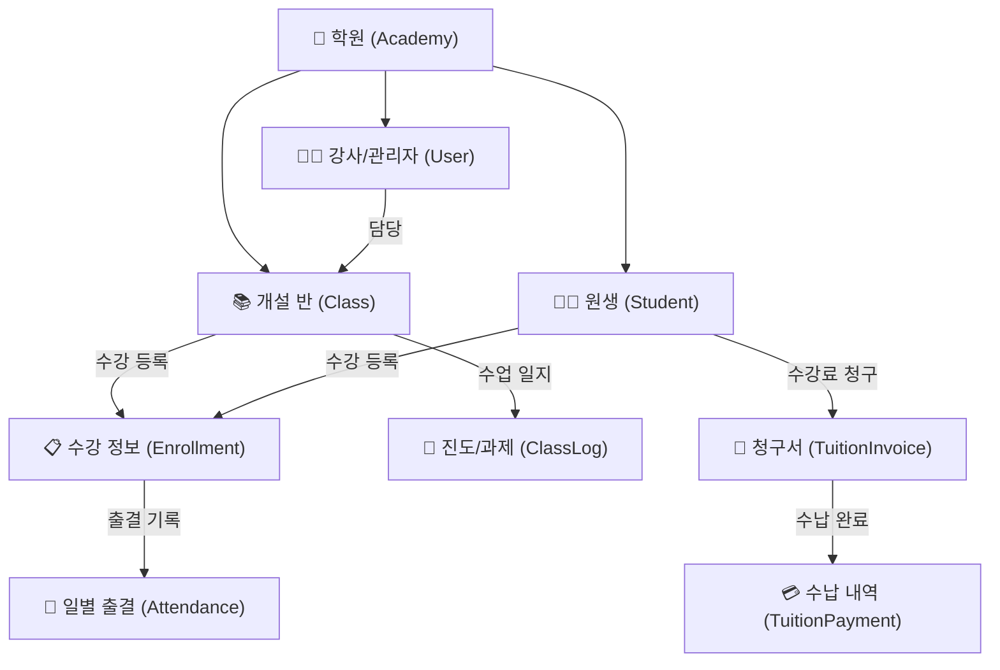

# 🏫 ClassHelper (학원 통합 관리 시스템)

> **ClassHelper**는 학원 원장님과 선생님들이 원생 출결 관리, 수업 진도 및 과제 체크, 수강료 납부 현황 관리 등을 한곳에서 빠르고 간편하게 처리할 수 [...]

---

## 📁 모노레포 프로젝트 구조 (Directory Structure)

```text
ClassHelper/
├── backend/                # NestJS + Prisma 백엔드 서버
│   ├── prisma/             # Prisma Schema 및 Migration
│   ├── src/                # 백엔드 비즈니스 로직
│   ├── test/               # Unit / E2E 테스트
│   ├── .env.example        # 환경 변수 템플릿
│   └── package.json
├── frontend/               # 프론트엔드 웹/모바일 앱 (예정)
├── docker-compose.yml      # 로컬 PostgreSQL 개발용 도커 설정
├── package.json            # 모노레포 공통 실행 스크립트
└── README.md
```

---

## 📌 주요 특징 및 해결하고자 하는 문제

- **1초 출결 체크**: 교실 안에서 모바일/태블릿으로 반별 학생들의 출결(출석, 결석, 지각, 조퇴)을 터치 한 번으로 기록
- **수납 및 미납 관리**: 매월 청구되는 원비 수납 현황을 실시간으로 추적하고 미납자 관리
- **수업 일지 및 진도 추적**: 반별/학생별 교재 진도와 과제 완성도를 기록하고 학부모 상담용 피드백 축적
- **선생님 업무 효율화**: 복잡한 행정 서류 작업을 전산화하여 교육 본연에 집중할 수 있는 환경 제공

---

## 🧱 핵심 4대 도메인 설계



</details>

### 1. 학생 및 반 관리 (`Students & Classes`)
- **학생(Student)**: 이름, 학교/학년, 연락처, 학부모 연락처, 재원 상태(`ACTIVE`, `ON_LEAVE`, `DISCHARGED`)
- **반(Class)**: 반 이름, 과목, 담당 강사, 수업 요일/시간, 정원, 기본 수강료
- **수강(Enrollment)**: 학생과 반 매핑 및 수강 시작/종료일 관리

### 2. 출결 관리 (`Attendance`)
- 일자별/수업별 학생 출결 상태 기록 (`PRESENT`, `ABSENT`, `LATE`, `EARLY_LEAVE`)
- 결석/지각 사유 메모 및 보강 필요 여부 기록

### 3. 수강료 및 수납 관리 (`Tuition & Payments`)
- 매월 정기 수강료 청구서(`TuitionInvoice`) 생성
- 수납 기록(`TuitionPayment`) 등록 (카드, 계좌이체, 현금) 및 결제 상태(`PAID`, `UNPAID`, `PARTIAL`) 관리

### 4. 진도 및 수업 일지 (`ClassLog & Homework`)
- 회차별 수업 진도(교재, 범위, 주요 학습 주제) 기록
- 과제 제출 여부 및 성취도 평가, 학생 개별 특이사항 기록

---

## 🌿 브랜치 및 커밋 컨벤션 (Git Conventions)

### 브랜치 네이밍 전략
- `main`: 배포 가능한 안정 버전 (Production)
- 기능 개발 브랜치: `feat/기능이름` (예: `feat/auth`, `feat/attendance`)
- 버그 수정 브랜치: `fix/수정이름` (예: `fix/invoice-calc`)

### 커밋 타입 표
| 타입 | 설명 |
| :--- | :--- |
| **`feat`** | 새로운 기능 추가 |
| **`fix`** | 버그 수정 |
| **`docs`** | 문서 수정 (코드 변경 없음) |
| **`style`** | 코드 포맷팅, 세미콜론 등 스타일 변경 (논리 변경 없음) |
| **`refactor`** | 리팩토링 (기능 변화 없음) |
| **`test`** | 테스트 관련 코드 추가/수정 |
| **`chore`** | 빌드, 패키지 매니저 설정 등 기타 작업 |
| **`design`** | CSS 등 사용자 UI 디자인 변경 |
| **`comment`** | 필요한 주석 추가 및 변경 |
| **`rename`** | 파일 혹은 폴더명을 수정하거나 옮기는 작업만인 경우 |
| **`remove`** | 파일을 삭제하는 작업만 수행한 경우 |
| **`!HOTFIX`** | 급하게 치명적인 버그를 고쳐야 하는 경우 |

---

## 🛠️ 기술 스택 (Tech Stack)

### Backend
- **Framework**: [NestJS](https://nestjs.com/) (Node.js)
- **Language**: [TypeScript](https://www.typescriptlang.org/)
- **Database & ORM**: [PostgreSQL 16](https://www.postgresql.org/) + [Prisma 7](https://www.prisma.io/)
- **Package Manager**: [Yarn](https://yarnpkg.com/)
- **API Documentation**: [Swagger (OpenAPI)](https://swagger.io/)
- **Testing**: [Jest](https://jestjs.io/) & Supertest (Unit / E2E)

---

## 🚀 개발 로드맵 (Milestones)


</details>

- **[x] Phase 0**: 프로젝트 요구사항 정의 및 아키텍처/README 수립
- **[x] Phase 1**: 모노레포 구조 세팅 및 NestJS + PostgreSQL 16 + Prisma 7 아키텍처 환경 구축
- **[x] Phase 2**: 확장성 및 멀티테넌시를 고려한 Prisma 스키마 모델링 (Academy, User, Student, Class, Attendance, Tuition, ClassLog)
- **[x] Phase 3-1**: 관리자/강사 JWT 인증 및 RBAC 인가 가드 구현 (완료)
- **[x] Phase 3-2**: 원생 관리(Students) CRUD API 및 필터/페이징/상태변경 구현 (완료)
- **[ ] Phase 3-3**: 반(Classes) 개설 및 수강생 매핑(Enrollments) 관리 API 구현
- **[ ] Phase 4**: 출결 체크 & 일자별 출결 현황 조회 API 구현
- **[ ] Phase 5**: 수강료 청구 및 수납 처리 API 구현
- **[ ] Phase 6**: 수업 일지/진도 기록 API 구현
- **[ ] Phase 7**: E2E 통합 테스트 및 배포 준비

---

## 💻 빠른 시작 (Getting Started)

### 1. 백엔드 패키지 설치
```bash
cd backend
yarn install
```

### 2. 환경 변수 설정
```bash
cp .env.example .env
```

### 3. PostgreSQL 컨테이너 실행 (Docker)
```bash
docker compose up -d
```

### 4. 데이터베이스 마이그레이션
```bash
yarn prisma:migrate
```

### 5. 백엔드 개발 서버 실행
```bash
yarn start:dev
```

### 6. Swagger API 문서 확인
서버 실행 후 브라우저에서 `http://localhost:3000/api-docs` 접속
