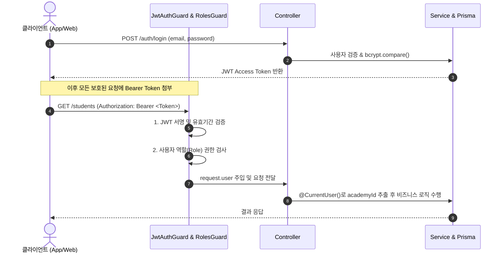

# 🔐 인증 & 인가(Security) 가이드

ClassHelper는 안전한 데이터 격리와 유연한 권한 관리를 위해 **JWT(JSON Web Token)** 기반의 무상태(Stateless) 인증 및 **RBAC(Role-Based Access Control)** 인가 시스템을 갖추고 있습니다.

---

## 🔄 인증 & 인가 처리 흐름



---

## 🎟️ JWT 페이로드 규격 (`JwtPayload`)

Access Token 생성 시 다음과 같은 사용자 핵심 정보가 페이로드에 포함됩니다:

```typescript
export interface JwtPayload {
  sub: number;       // 사용자 고유 ID (User.id)
  academyId: number; // 소속 학원 ID (멀티테넌시 식별자)
  email: string;     // 로그인 이메일
  name: string;      // 사용자 이름
  role: UserRole;    // 권한 (OWNER | ADMIN | TEACHER | STAFF)
}
```

---

## 🛠️ 커스텀 데코레이터 & 가드 사용법

### 1. `@CurrentUser()`
요청을 보낸 사용자의 인증 정보를 손쉽게 주입받을 수 있습니다.

```typescript
import { CurrentUser, CurrentUserPayload } from '../common/decorators/current-user.decorator';

@Get('my-classes')
async getMyClasses(
  @CurrentUser() user: CurrentUserPayload,          // 전체 페이로드 객체
  @CurrentUser('academyId') academyId: number,     // 특정 필드만 추출
  @CurrentUser('userId') teacherId: number,
) {
  return this.classesService.findByTeacher(academyId, teacherId);
}
```

### 2. `@Roles(...)` & `RolesGuard`
특정 엔드포인트에 접근 가능한 역할을 제한합니다.

```typescript
import { Roles } from '../common/decorators/roles.decorator';
import { RolesGuard } from '../common/guards/roles.guard';
import { JwtAuthGuard } from '../common/guards/jwt-auth.guard';
import { UserRole } from '@prisma/client';

@Controller('admin')
@UseGuards(JwtAuthGuard, RolesGuard)
export class AdminController {
  @Post('staff')
  @Roles(UserRole.OWNER, UserRole.ADMIN) // 원장님 또는 실장님만 접근 가능
  async createStaff(...) { ... }
}
```

### 3. `@Public()`
전역 가드가 적용된 환경에서 인증 없이 접근을 허용할 때 사용합니다.

```typescript
import { Public } from '../common/decorators/public.decorator';

@Public()
@Get('health')
getHealth() {
  return { status: 'ok' };
}
```

---

## 🛡️ 보안 정책 및 모범 사례

1. **비밀번호 단방향 암호화 (`bcrypt`)**:
   - 사용자의 비밀번호는 10 rounds의 솔트(Salt)를 적용하여 해싱 저장됩니다.
   - 평문 비밀번호는 어떠한 경우에도 DB에 저장되거나 로그에 기록되지 않습니다.
2. **소속 테넌트 격리 (`academyId`)**:
   - 클라이언트에서 전달하는 `academyId`를 그대로 신뢰하지 않고, 항상 검증된 **JWT 페이로드의 `user.academyId`**를 기준으로 데이터를 조회/수정/삭제합니다.
3. **환경 변수 관리**:
   - `JWT_SECRET`은 최소 32자 이상의 무작위 문자열로 운영 환경에 설정되어야 합니다.
   - Access Token의 기본 만료 기간은 `7d`로 설정되어 있으며, 필요 시 `.env`의 `JWT_EXPIRES_IN`에서 조정할 수 있습니다.
