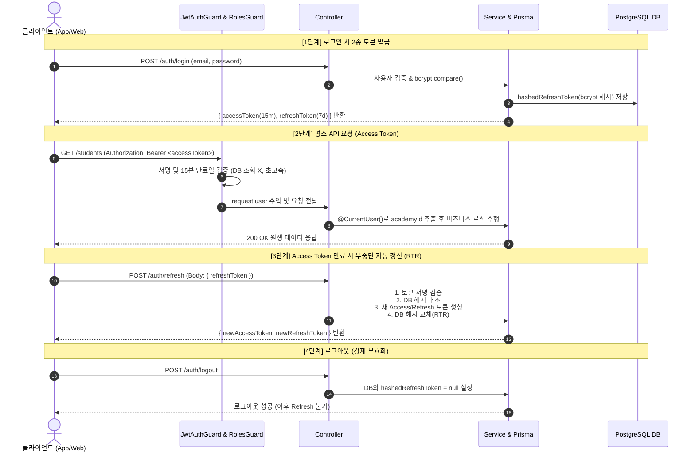

# 🔐 인증 & 인가(Security) 가이드

ClassHelper는 안전한 데이터 격리와 무중단 사용자 경험을 위해 **Access Token(15분) + Refresh Token(7일)** 이중 토큰 체계 및 **RTR(Refresh Token Rotation)**과 **RBAC(Role-Based Access Control)** 인가 시스템을 갖추고 있습니다.

---

## 🔄 이중 토큰 인증 & 인가 처리 흐름



---

## 🎟️ 토큰 사양 및 페이로드 규격

### 1. 토큰 사양 비교
| 구분 | 유효 기간 | 서명 비밀키 | 저장 위치 및 용도 |
| :--- | :--- | :--- | :--- |
| **Access Token** | **15분 (`15m`)** | `JWT_ACCESS_SECRET` | 모든 비즈니스 API 요청 시 `Authorization: Bearer` 헤더로 전송 |
| **Refresh Token** | **7일 (`7d`)** | `JWT_REFRESH_SECRET` | Access Token 만료 시 새 토큰 세트를 발급받기 위한 일회용 키 (DB에 bcrypt 해시 저장) |

### 2. 페이로드 규격 (`JwtPayload`)
```typescript
export interface JwtPayload {
  sub: number;       // 사용자 고유 ID (User.id)
  academyId: number; // 소속 학원 ID (멀티테넌시 식별자)
  email: string;     // 로그인 이메일
  name: string;      // 사용자 이름
  role: UserRole;    // 권한 (OWNER | ADMIN | TEACHER | STAFF)
}
```

---

## 🛠️ 커스텀 데코레이터 & 가드 사용법

### 1. `@CurrentUser()`
요청을 보낸 사용자의 인증 정보를 손쉽게 주입받을 수 있습니다.

```typescript
import { CurrentUser, CurrentUserPayload } from '../common/decorators/current-user.decorator';

@Get('my-classes')
async getMyClasses(
  @CurrentUser() user: CurrentUserPayload,          // 전체 페이로드 객체
  @CurrentUser('academyId') academyId: number,     // 특정 필드만 추출
  @CurrentUser('userId') teacherId: number,
) {
  return this.classesService.findByTeacher(academyId, teacherId);
}
```

### 2. `@Roles(...)` & `RolesGuard`
특정 엔드포인트에 접근 가능한 역할을 제한합니다.

```typescript
import { Roles } from '../common/decorators/roles.decorator';
import { RolesGuard } from '../common/guards/roles.guard';
import { JwtAuthGuard } from '../common/guards/jwt-auth.guard';
import { UserRole } from '@prisma/client';

@Controller('admin')
@UseGuards(JwtAuthGuard, RolesGuard)
export class AdminController {
  @Post('staff')
  @Roles(UserRole.OWNER, UserRole.ADMIN) // 원장님 또는 실장님만 접근 가능
  async createStaff(...) { ... }
}
```

### 3. `@Public()`
전역 가드가 적용된 환경에서 인증 없이 접근을 허용할 때 사용합니다.

```typescript
import { Public } from '../common/decorators/public.decorator';

@Public()
@Get('health')
getHealth() {
  return { status: 'ok' };
}
```

---

## 🛡️ 보안 강화 정책 (RTR & 해싱 저장)

1. **Refresh Token 해싱 저장 (Database Hashing)**:
   - 사용자의 Refresh Token은 원본 그대로 DB에 저장되지 않고, 비밀번호처럼 **`bcrypt`로 10 rounds 해싱**되어 저장됩니다.
   - DB 데이터가 외부로 유출되더라도 탈취된 해시값으로 토큰을 위조할 수 없습니다.
2. **Refresh Token Rotation (RTR - 일회용 교체 원리)**:
   - `POST /auth/refresh`를 호출할 때마다 이전 Refresh Token은 폐기되고 **새로운 Refresh Token이 함께 발급**됩니다.
   - 이미 사용되었거나 위조된 Refresh Token으로 재발급을 시도하면 서버가 탈취 시도로 판단하고 **해당 계정의 DB Refresh Token을 즉시 삭제(null)하여 강제 로그아웃**시킵니다.
3. **즉각적인 로그아웃 및 접근 차단 (`POST /auth/logout`)**:
   - 사용자가 로그아웃하거나 관리자가 강제 차단할 경우 DB의 `hashedRefreshToken`을 `null`로 초기화하여 재발급 권한을 즉시 박탈합니다.
4. **환경 변수 관리**:
   - `JWT_ACCESS_SECRET` 및 `JWT_REFRESH_SECRET`은 각각 분리된 강력한 무작위 문자열로 관리됩니다.
